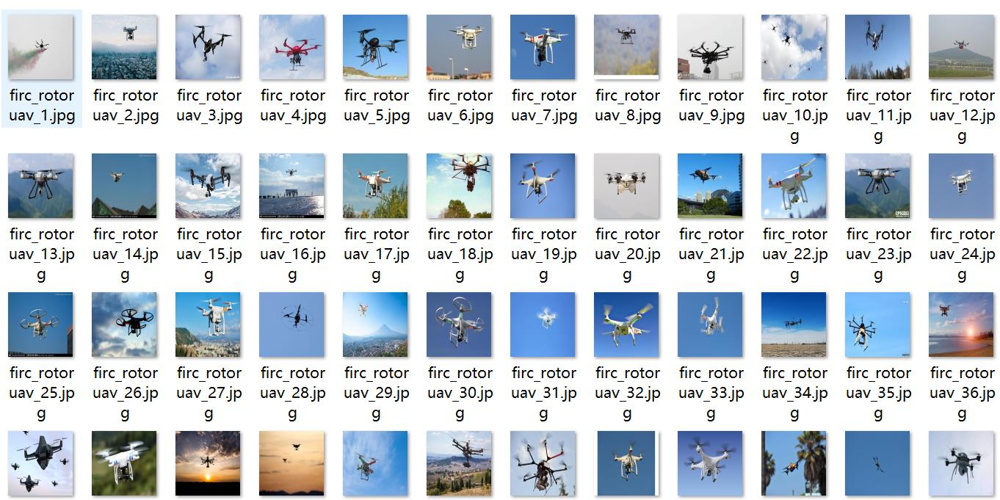
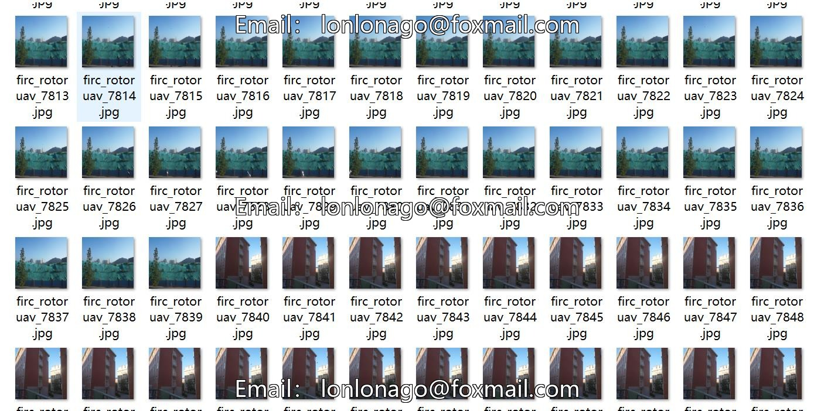
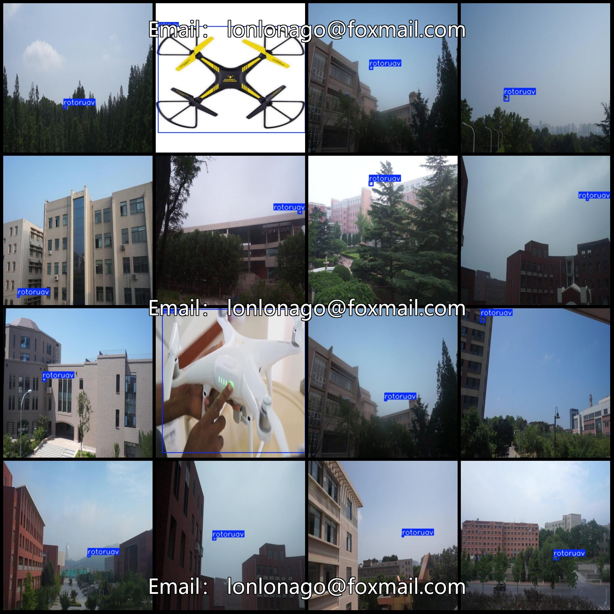
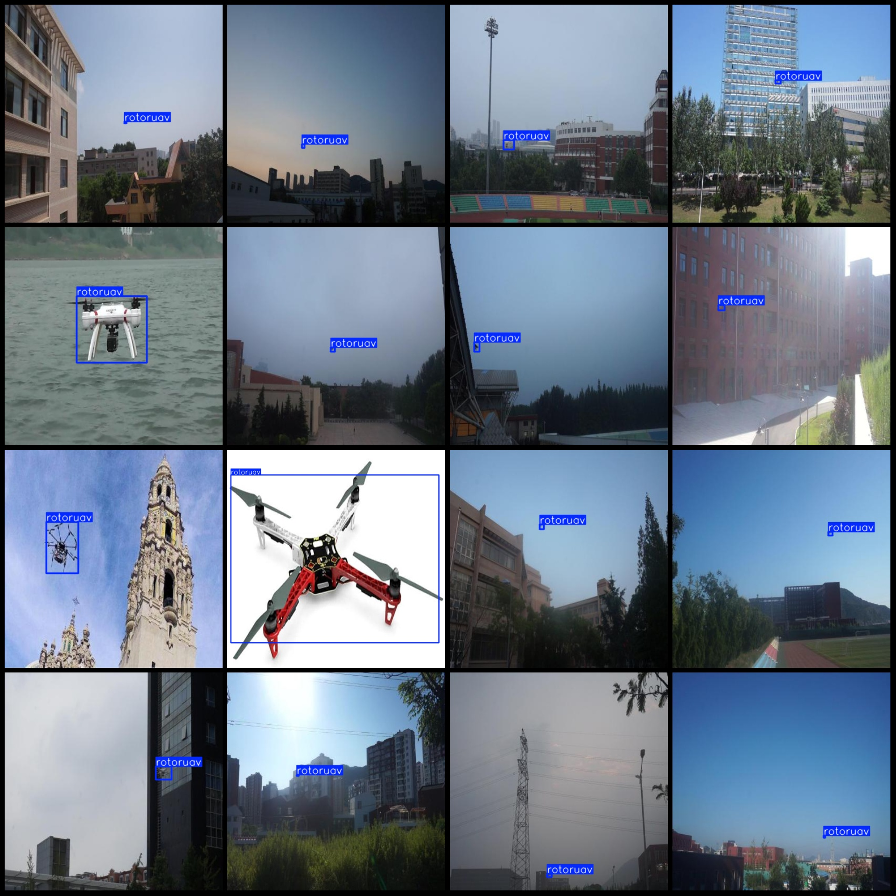

# UAV Detection Dataset VOC+YOLO format with 9132 images and 1 class

The dataset format includes Pascal VOC format and YOLO format (excluding the split path in the txt file, only containing jpg images along with corresponding VOC and YOLO format txt files).

Number of images: 9132
Number of annotations: 9132
Number of annotations: 9132
Number of categories: 1
Annotation category name: ["rotoruav"]
Number of bounding boxes per category: 9324
Total bounding boxes: 9324
Image resolution: 416x416
Annotation tool used: labelImg
Annotation rules: drawing bounding boxes for each category
Important note: No specific instructions provided at this time.
Special declaration: This dataset does not guarantee the accuracy of the trained models or weight files.
Image preview: 
Annotation example:
## Image

Here is a pay link on Stripe ( https://buy.stripe.com/3cs8yP7sY87d0vu9AB ). Please contact me lonlonago@foxmail.com after funding $89, and I will send you a complete data files , thank you!

